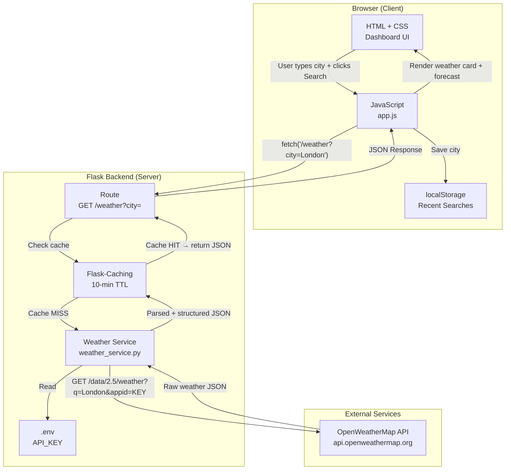
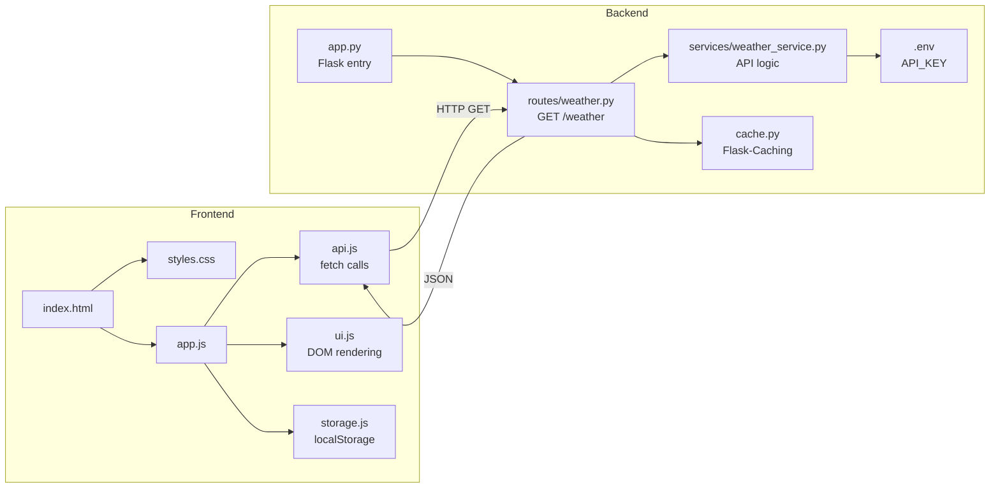
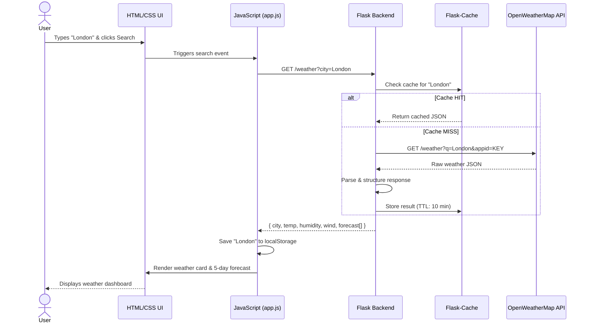

# Weather Dashboard App — Plan

## Functional Requirements

### Frontend (HTML + CSS + JavaScript)
- F1: Display current weather (temperature, humidity, wind speed, condition) for a searched city
- F2: Search for a city by name
- F3: Show a 5-day / 7-day weather forecast
- F4: Display weather icons matching current conditions (sunny, cloudy, rainy, etc.)
- F5: Show date and local time for the searched location
- F6: Toggle between Celsius and Fahrenheit
- F7: Display a loading spinner while fetching data
- F8: Show error messages for invalid city names or API failures
- F9: Save recent searches (last 5 cities) using localStorage
- F10: Auto-detect user's current location via browser Geolocation API

### Backend (Flask)
- F11: Expose a REST API endpoint `GET /weather?city=<name>`
- F12: Fetch weather data from a third-party API (e.g., OpenWeatherMap)
- F13: Return structured JSON response to the frontend
- F14: Handle invalid city names with appropriate HTTP error codes (400, 404)
- F15: Cache repeated requests for the same city to reduce API calls
- F16: Support CORS so the frontend can call the Flask API

---

## Non-Functional Requirements

### Performance
- NF1: API response time under 1 second for cached results
- NF2: Initial page load under 2 seconds on a standard connection
- NF3: Cache weather data for 10 minutes to avoid redundant API calls

### Security
- NF4: API key stored in environment variables, never in source code
- NF5: Sanitize and validate all user inputs on the backend
- NF6: Rate-limit the Flask API (e.g., 60 requests/minute per IP)
- NF7: Use HTTPS in production

### Usability
- NF8: Responsive design — works on mobile, tablet, and desktop
- NF9: Accessible UI (ARIA labels, sufficient color contrast)
- NF10: Intuitive layout requiring no user documentation

### Reliability
- NF11: Graceful degradation if the third-party weather API is unavailable
- NF12: Backend uptime target of 99.9% in production

### Maintainability
- NF13: Modular JavaScript (separate files for API calls, UI rendering, state)
- NF14: Flask code organized with blueprints or clear separation of routes and services
- NF15: Environment-based configuration (development vs production)

---

## User Stories

### US1 — Search Weather by City
> As a traveler, I want to search for current weather by city name, so that I can check conditions before visiting a new destination.

Acceptance Criteria:
- A search bar is visible on the homepage
- Entering a valid city name displays temperature, humidity, wind speed, and weather condition
- An error message is shown if the city is not found
- Results appear within 2 seconds

### US2 — View Multi-Day Forecast
> As a daily commuter, I want to see a 5-day weather forecast for my city, so that I can plan my week and dress appropriately.

Acceptance Criteria:
- After searching a city, a 5-day forecast is displayed below current weather
- Each day shows date, weather icon, high/low temperature
- Forecast updates when a new city is searched

### US3 — Toggle Temperature Unit
> As an international user, I want to switch between Celsius and Fahrenheit, so that I can view temperatures in the unit I'm familiar with.

Acceptance Criteria:
- A toggle button (°C / °F) is always visible
- All temperature values update instantly without re-fetching data
- The selected unit is remembered across page refreshes via localStorage

### US4 — Auto-Detect My Location
> As a busy professional, I want to see my local weather automatically when I open the app, so that I don't have to manually type my city every time.

Acceptance Criteria:
- On first load, the browser prompts for location permission
- If granted, current weather and forecast are loaded for the user's location
- If denied, the search bar is focused and ready for manual input
- A "Use My Location" button allows re-triggering geolocation at any time

---

## Architecture

### Architecture Diagram



### Component Breakdown



### Data Flow (Sequence)



### Step-by-Step Data Flow
1. User types city name and clicks Search
2. JavaScript calls `GET /weather?city=London` on Flask backend
3. Flask checks cache — returns cached JSON if available (TTL: 10 min)
4. On cache miss, Flask calls OpenWeatherMap API with stored API key
5. Response is parsed, structured, cached, and returned as JSON
6. JavaScript renders weather card and 5-day forecast
7. City saved to localStorage for recent searches

### JSON Response Contract
```json
{
  "city": "London",
  "country": "GB",
  "temperature": 18.5,
  "feels_like": 17.2,
  "humidity": 72,
  "wind_speed": 5.1,
  "condition": "Cloudy",
  "icon": "04d",
  "forecast": [
    { "date": "2026-07-23", "high": 20, "low": 14, "condition": "Sunny", "icon": "01d" },
    { "date": "2026-07-24", "high": 17, "low": 12, "condition": "Rainy", "icon": "10d" }
  ]
}
```

### Error Handling
| Scenario | HTTP Status | JS Handling |
|----------|-------------|-------------|
| City not found | 404 | Show error banner |
| OWM API down | 503 | Show retry button |
| Missing city param | 400 | Validate before sending |
| Rate limit exceeded | 429 | Throttle UI requests |

---

## Folder Structure

```
weather-dashboard/
│
├── backend/
│   ├── app.py
│   ├── config.py
│   ├── .env
│   ├── requirements.txt
│   ├── routes/
│   │   └── weather.py
│   └── services/
│       └── weather_service.py
│
├── frontend/
│   ├── index.html
│   ├── css/
│   │   └── styles.css
│   └── js/
│       ├── app.js
│       ├── api.js
│       ├── ui.js
│       └── storage.js
│
└── tests/
    ├── test_weather_route.py
    └── test_weather_service.py
```

### requirements.txt
```
flask
flask-cors
flask-caching
requests
python-dotenv
```

### .env (never commit)
```
OPENWEATHER_API_KEY=your_api_key_here
FLASK_ENV=development
```
